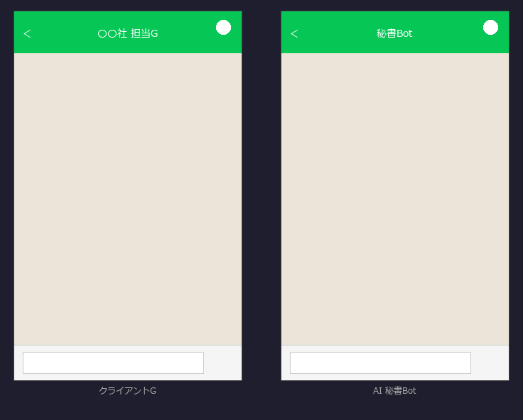

# LINE 秘書ボット

LINE 公式アカウント上で動く AI 秘書ボット。受け取ったメッセージに対して返信案を自動生成し、GAS 経由で LINE 会話履歴・Gmail を取得して状況把握をサポートします。



---

## 概要

LINE 公式アカウントでの顧客対応では、返信文の作成や過去のやり取りの確認に時間を取られがちです。
本ボットは、LINE に届いたメッセージへの**返信案を AI（Claude）が自動生成**し、過去の LINE 会話や Gmail の状況も**「まとめ」コマンド一つで要約**します。一次対応の下書きと状況把握を任せることで、個人事業主・小規模チームの問い合わせ対応を軽くします。

- **こんな方に**：LINE 公式アカウントで顧客対応する個人事業主・店舗・小規模事業者
- **解決する課題**：返信文作成の手間 ／ 過去のやり取りの確認コスト ／ 対応漏れ
- **使い方**：友だち追加 → メッセージ送信で返信案を受け取る ／「まとめ」と送ると会話・メールを要約

---

## 機能

| 機能 | 説明 |
|------|------|
| **返信案生成** | 受け取ったメッセージにクライアント情報を踏まえた返信案を Claude が生成。修正指示も会話履歴を踏まえて対応 |
| **まとめモード** | 「まとめ」と送信すると LINE 会話ログ・Gmail 一覧を AI が要約してレポート |
| **会話メモリ** | ユーザーごとに直近の会話を保持し、TTL による自動失効を実装 |
| **GAS 連携** | Google Apps Script 経由で LINE 会話ログと Gmail 一覧を取得しコンテキストとして利用 |

## アーキテクチャ

```
LINE → Webhook → FastAPI → Claude API → push_message → LINE
                    ↑
               GAS Web App
          (LINE ログ・Gmail 取得)
```

## 技術スタック

| カテゴリ | 採用技術 |
|---------|---------|
| バックエンド | Python 3.11 / FastAPI / uvicorn |
| AI | Anthropic API（Claude Sonnet） |
| メッセージング | LINE Messaging API（line-bot-sdk v3） |
| 外部連携 | Google Apps Script（LINE ログ・Gmail 取得） |
| 非同期処理 | asyncio / FastAPI BackgroundTasks |

## セットアップ

```bash
python -m venv venv
venv\Scripts\activate   # Windows
# source venv/bin/activate  # Mac/Linux
pip install -r requirements.txt
```

`.env` ファイルを作成して以下を設定：

```env
LINE_CHANNEL_SECRET=your_channel_secret
LINE_CHANNEL_ACCESS_TOKEN=your_access_token
ANTHROPIC_API_KEY=your_anthropic_api_key

# 任意：GAS 連携を使う場合
GAS_LINE_LOG_WEB_APP_URL=https://script.google.com/...
GAS_GMAIL_WEB_APP_URL=https://script.google.com/...
```

## 起動

```bash
uvicorn main:app --reload
```

LINE Developers の Webhook URL に `https://<your-domain>/callback` を設定してください。

## 環境変数一覧

| 変数名 | 必須 | 説明 |
|--------|------|------|
| `LINE_CHANNEL_SECRET` | ✅ | LINE チャネルシークレット |
| `LINE_CHANNEL_ACCESS_TOKEN` | ✅ | LINE チャネルアクセストークン |
| `ANTHROPIC_API_KEY` | ✅ | Anthropic API キー |
| `GAS_LINE_LOG_WEB_APP_URL` | - | LINE 会話ログ取得 GAS URL |
| `GAS_LINE_LOG_DAYS` | - | LINE ログ取得日数（デフォルト: 3） |
| `GAS_GMAIL_WEB_APP_URL` | - | Gmail 一覧取得 GAS URL |
| `GAS_GMAIL_DAYS` | - | メール取得日数（デフォルト: 3） |
| `GAS_GMAIL_MAX` | - | メール最大取得件数（デフォルト: 50） |
| `MEMORY_MAX_TURNS` | - | 会話メモリ保持ターン数（デフォルト: 5） |
| `MEMORY_TTL_SECONDS` | - | 会話メモリ失効時間（デフォルト: 3600秒） |
